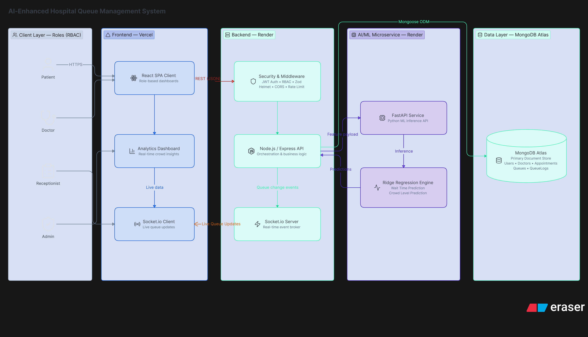
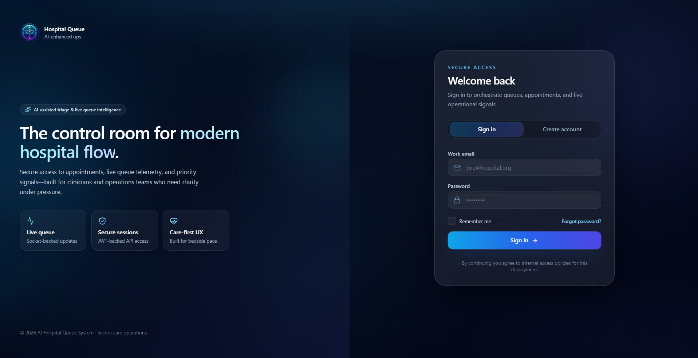
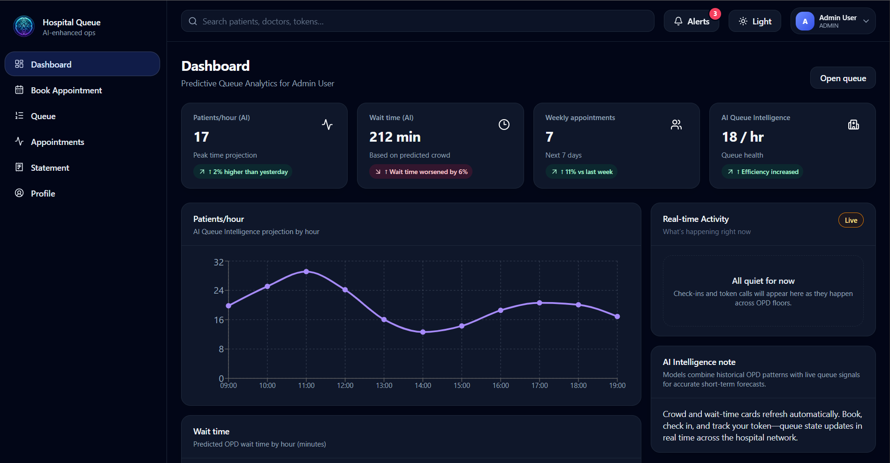
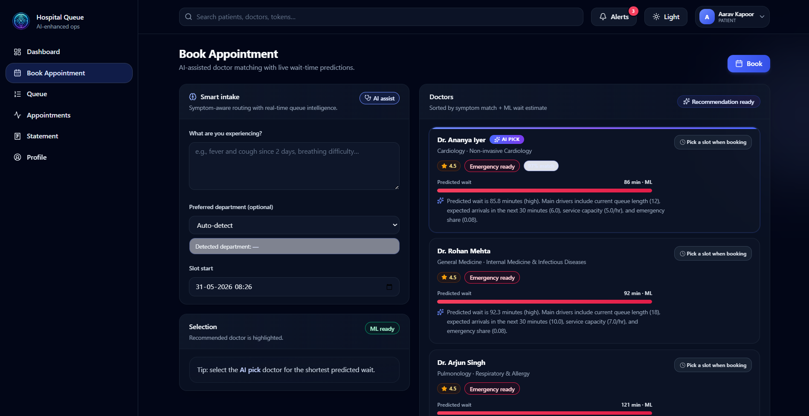
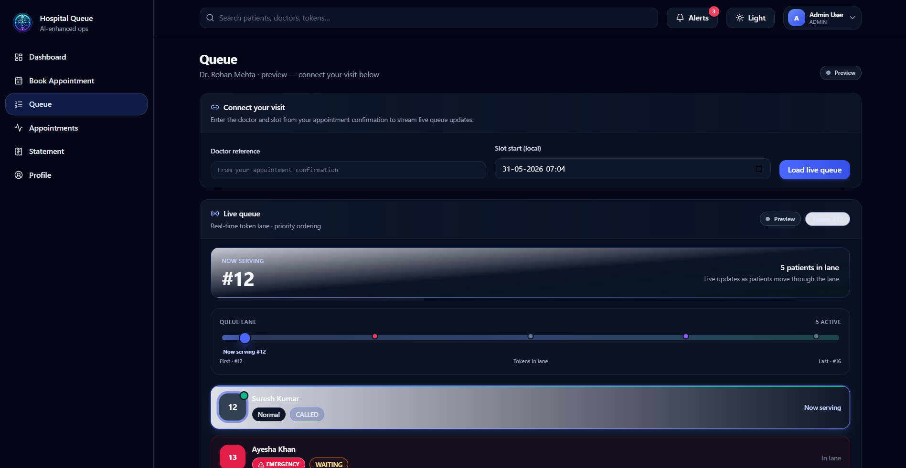
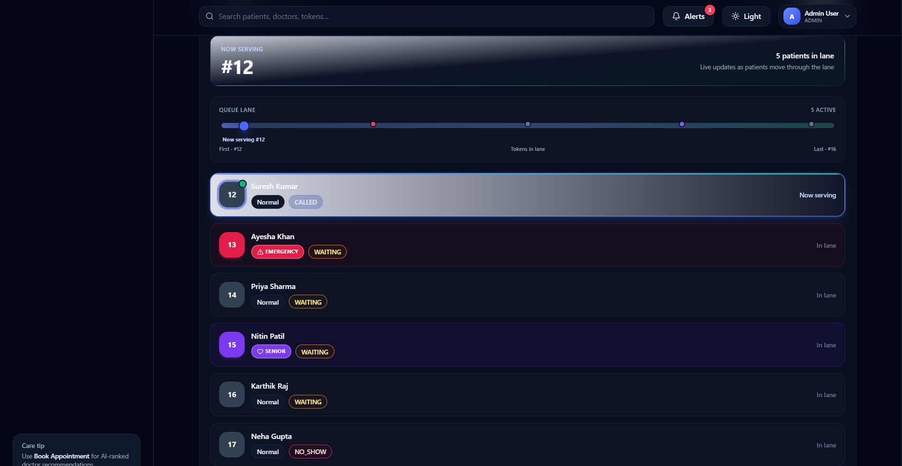
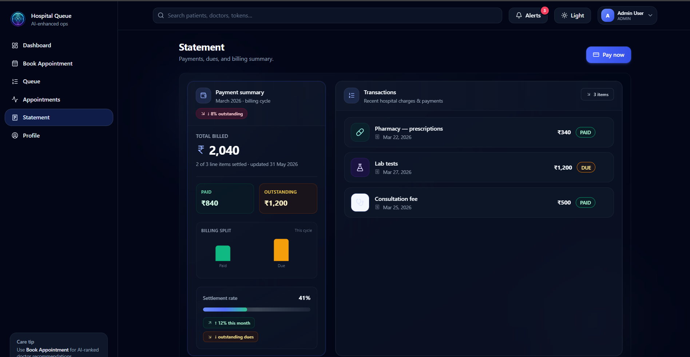
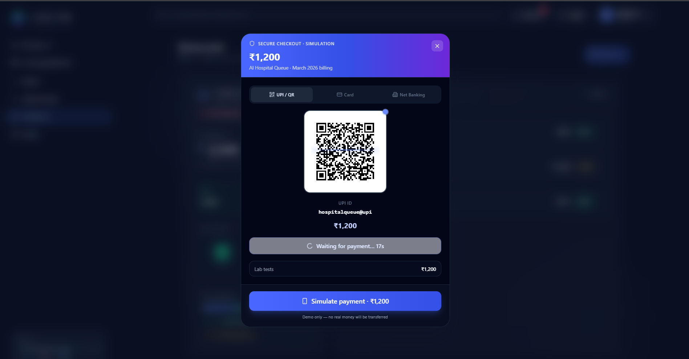
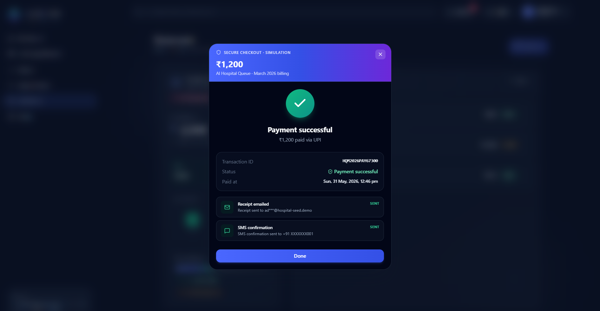

# 🏥 AI-Enhanced Hospital Queue Management System


An intelligent hospital management and queue optimization platform built using the MERN stack, Socket.io, and Machine Learning.

The system enables patients to book appointments, receive queue tokens, monitor live queue status, and estimate waiting times using predictive analytics. Administrators and doctors can efficiently manage patient flow, reduce overcrowding, and improve operational efficiency through real-time dashboards and smart queue management.

## 🌐 Live Application:
   
   https://ai-enhanced-hospital-queue-manageme.vercel.app

## ✨ Key Features

* Secure JWT-based Authentication
* Role-Based Access Control (Admin, Doctor, Patient, Receptionist)
* Appointment Booking System
* Smart Queue Management
* Real-Time Queue Updates using Socket.io
* ML-Based Wait-Time Prediction
* Crowd Density Estimation
* Queue Skip & No-Show Handling
* Interactive Analytics Dashboard
* Payment Simulation Module
* Responsive Modern UI

## 🛠️ Tech Stack

### Frontend


### Backend

* Node.js
* Express.js
* JWT Authentication
* Socket.io
* Mongoose
* Zod
* Helmet
* CORS
* Express Rate Limit

### Database

* MongoDB Atlas

### Machine Learning

* Python
* FastAPI

### Deployment

* Vercel
* Render

## 🏗️ System Architecture




## 📸 Screenshots

### Login


### Dashboard


### Appointment


### Queue Management



### Payment




### Profile


## 🔌 API Modules

___________________________________________________
|     Module      |          Purpose              |
|-----------------|-------------------------------|
| Auth API        | Login, Signup, JWT            |
| Doctor API      | Doctor directory              | 
| Appointment API | Booking & Check-in            |
| Queue API       | Queue operations              | 
| Admin API       | User approvals                |
| Prediction API  | Wait-time & Crowd forecasting |
|_________________|_______________________________|


## 📂 Project Structure

```text
frontend/
backend/
ml-service/
docs/
screenshots/
```


## ☁️ Deployment

- Frontend: Vercel
- Backend API: Render
- ML Service: Render
- Database: MongoDB Atlas


## 📊 Key Highlights

* Real-time hospital queue tracking
* Predictive wait-time estimation
* Smart crowd forecasting
* Multi-role healthcare workflow
* Production deployment on Vercel and Render

## 🔮 Future Enhancements

* SMS/email notifications
* Real payment gateway integration
* Redis adapter for Socket.io scaling
* Production ML training on real anonymized hospital data
* Automated testing


## ⚙️ Local Setup

1. **MongoDB** must be running locally (or update `MONGO_URI`).
2. Copy env files:
   - `backend/.env.example` -> `backend/.env`
   - `frontend/.env.example` -> `frontend/.env`
3. Install deps:
   - root: `npm install`
   - backend  : `npm install --prefix backend`
   - frontend : `npm install --prefix frontend`
   - ml       : `ml-service\\venv_ml\\Scripts\\uvicorn app.main:app --app-dir ml-service --reload --port 8001`
   
4. Seed realistic data:
   - `npm run seed`
5. Start all services:
   - `npm run dev`

This starts:
- backend API: `http://localhost:5000`
- frontend: `http://localhost:5173`
- ML service: `http://localhost:8001`


## 🧪 Local Seed Accounts

- Patient: `patient1@hospital-seed.demo` / `Password@123`
- Doctor: `doctor1@hospital-seed.demo` / `Password@123`
- Admin: `admin@hospital-seed.demo` / `Password@123`
- Receptionist: `reception@hospital-seed.demo` / `Password@123`


